# практическа работа 3
## ЭФМО-02-25 Фомичев Александр Сергеевич
### Структура проекта:
```
pz3-http/
  cmd/
    server/
      main.go
  internal/
    api/
      handlers.go
      middleware.go
      responses.go
    storage/
      memory.go
  go.mod
```
## Цели занятия
-	Освоить базовую работу со стандартной библиотекой net/http без сторонних фреймворков.
-	Научиться поднимать HTTP-сервер, настраивать маршрутизацию через http.ServeMux.
-	Научиться обрабатывать параметры запроса (query, path), тело запроса (JSON/form-data) и формировать корректные ответы (код статуса, заголовки, JSON).
-	Научиться базовому логированию запросов и обработке ошибок.

## 1) Первый сервер и маршрут GET /health

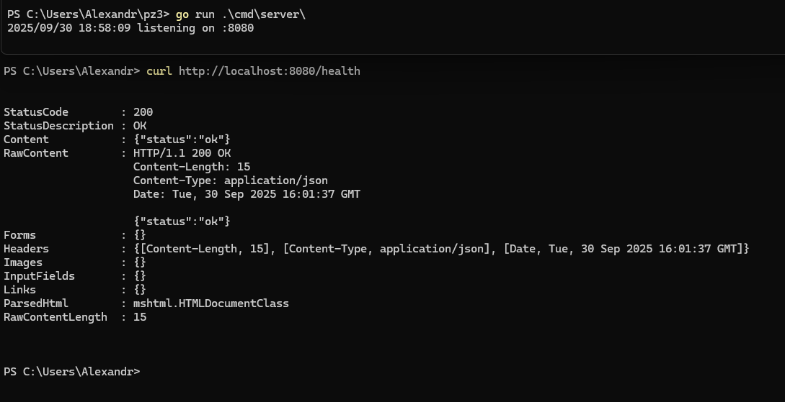
**проверка**

## 2) Второй сервер 

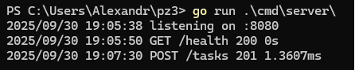
**запуск**

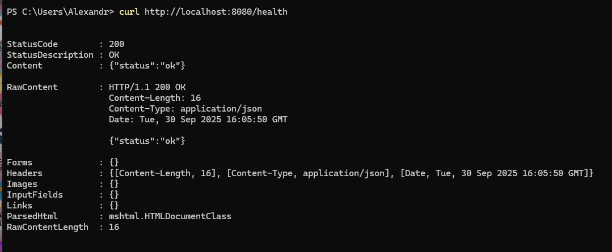
**GET /health**

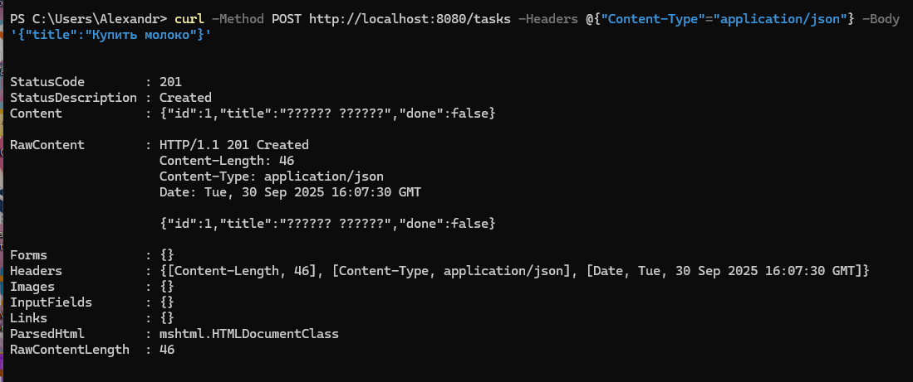
**POST /tasks (создание 1)**

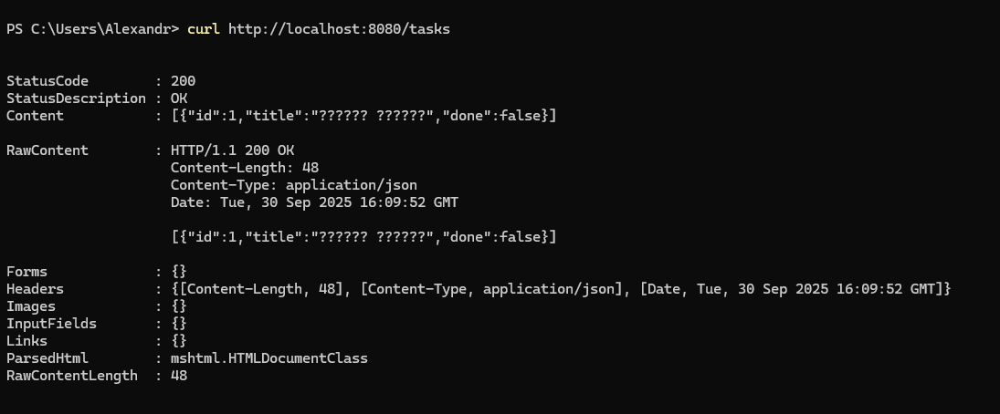
**GET /tasks (проверка всего списка 1)**

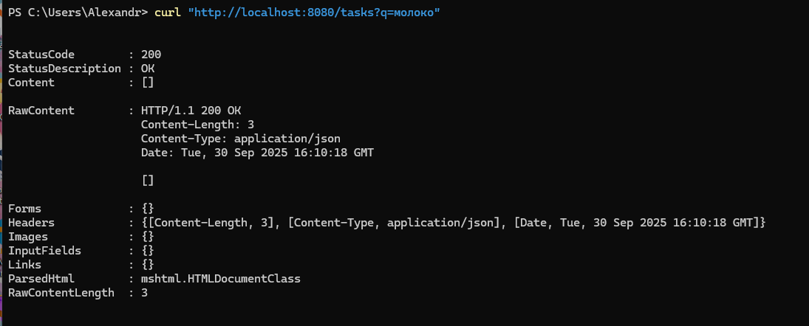
**GET /tasks (проверка если что то конкретное в списке)**
**примечание у меня не сработалло потому что не воспринял русский**

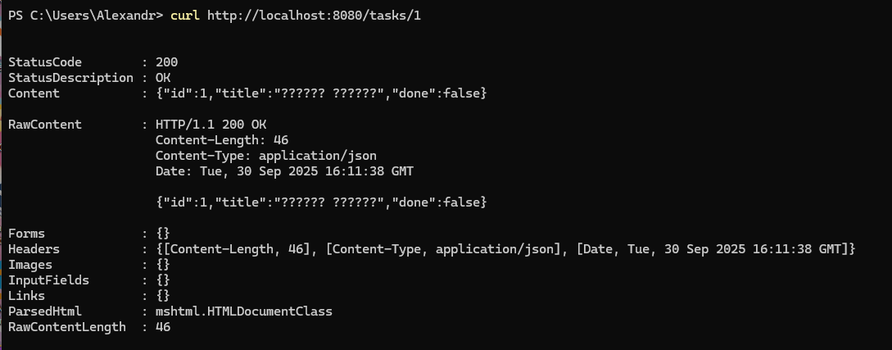
**GET /tasks (проверка всписке по номеру)**

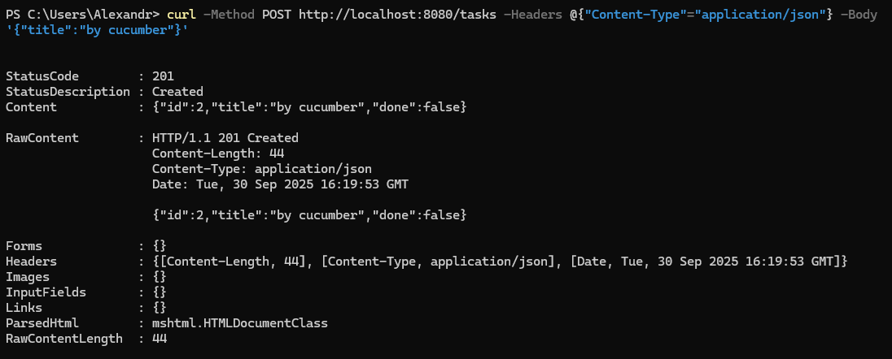
**POST /tasks (создание 2)**

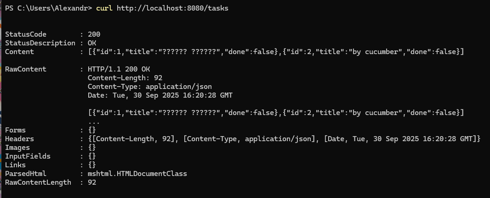
**GET /tasks (проверка всего списка 2)**

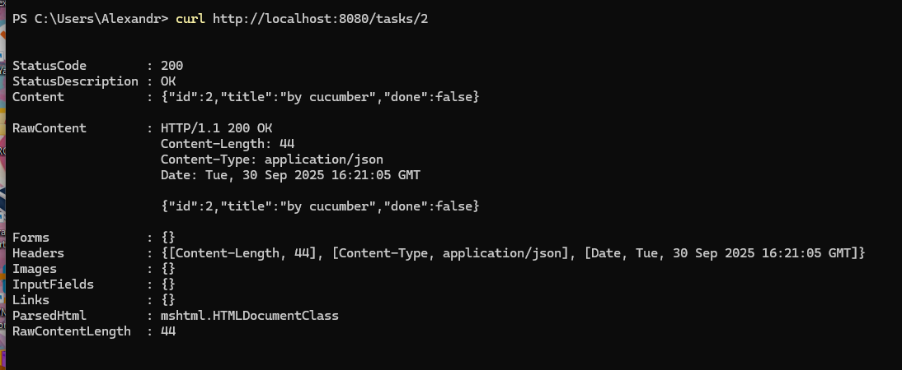
**GET /tasks (проверка всписке по номеру)**

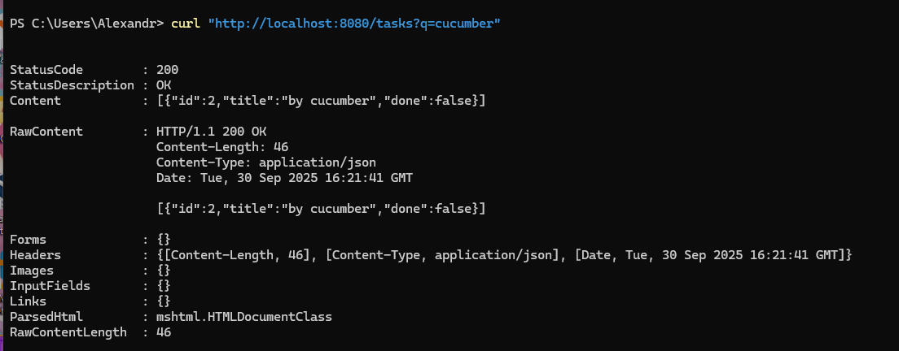
**GET /tasks (проверка если что то конкретное в списке)**
